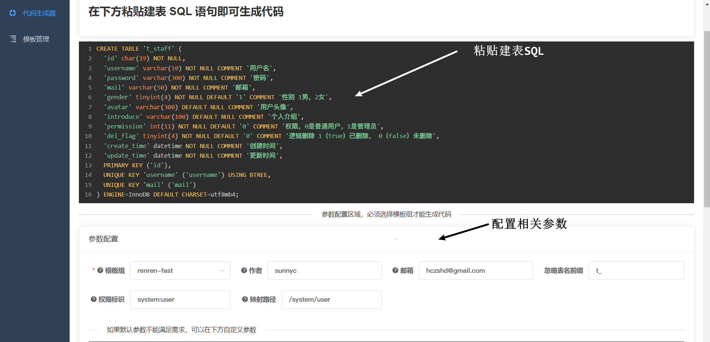
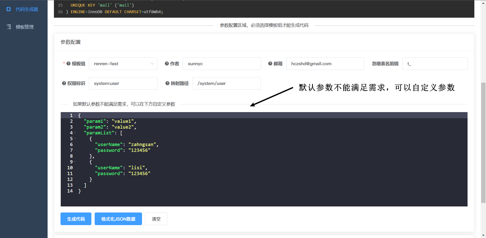
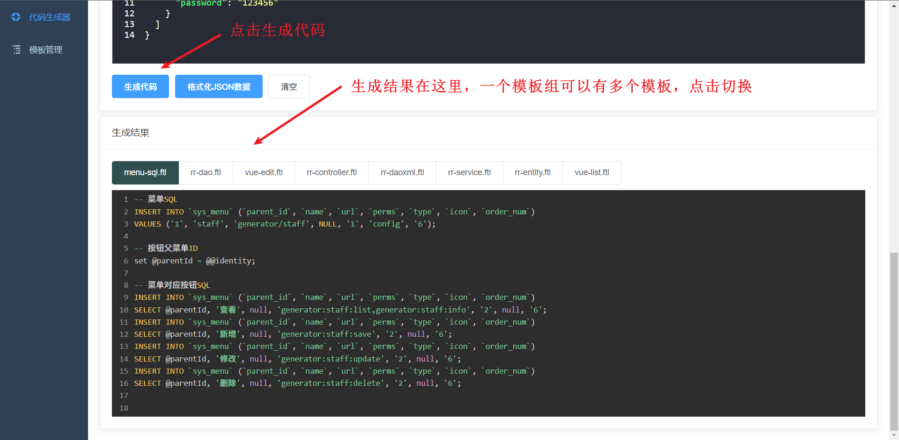
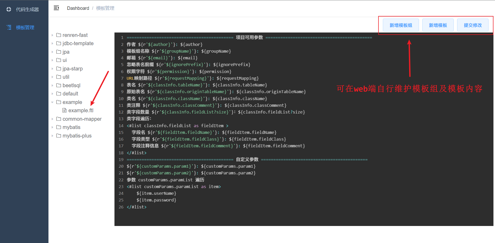

# code-generator
使用 SpringBoot+Vue 开发

根据建表 SQL 语句生成 实体类、mapper、service、serviceImpl、controller 代码

## 开发原因
工作中重复的 CRUD 内容太多，表字段又很多，故开发此代码生成器

基于项目：https://github.com/moshowgame/SpringBootCodeGenerator 开发，感谢作者 @moshowgame

**主要添加了可自定义模板功能，可自定义代码生成的模板，完全在 web 端即可新增自己的模板，并且使用自己自定义的模板生成代码**

演示地址：http://49.233.159.81:21345/

## 模板编写指南

项目中用的自定义模板是 FreeMarker，附上一份项目模板编写说明：https://www.sunnyc.icu/articles/4bfb823a/

## 部署

部署需要安装 [docker](https://docs.docker.com/engine/install/#server) 和 [docker-compose](https://docs.docker.com/compose/install/#install-compose-on-linux-systems)

或者直接安装 [docker 桌面版](https://www.docker.com/products/docker-desktop/)

1. 创建 docker-compose.yml 文件，21345 可以改成任意你喜欢的端口号，后续通过此端口号访问项目

   ```yaml
   version: "3"
   services:
     api:
       image: hsunnyc/code-generator-server:1.0.1
       restart: always
       volumes:
         - ./templates:/opt/service/code-generator/templates
         - ./deleted:/opt/service/code-generator/deleted
       environment:
         TZ: Asia/Shanghai
     web:
       image: hsunnyc/code-generator-ui:1.0.1
       restart: always
       environment:
         TZ: Asia/Shanghai
       ports:
         - "21345:80"
       depends_on:
         - api
   ```

2. 启动，在 docker-compose.yml 同级目录下

   ```shell
   # 前台启动
   docker-compose up
   # 后台启动 [推荐]
   docker-compose up -d
   # 停止
   docker-compose down
   ```

3. 在你 docker-compose.yml 同级目录下会出现 templates 和 deleted 两个文件夹

   - templates：存储模板组，也就是目前所有模板文件
   - deleted ：存储已删除的模板文件

4. 访问 `http://[your_ip]:21345`

## 特性

### 1. 解析建表 SQL，根据模板生成代码







### 2. 可自定义生成代码的模板



## TODO

- [x] 可自定义代码生成模板
- [x] 模板编写指南
